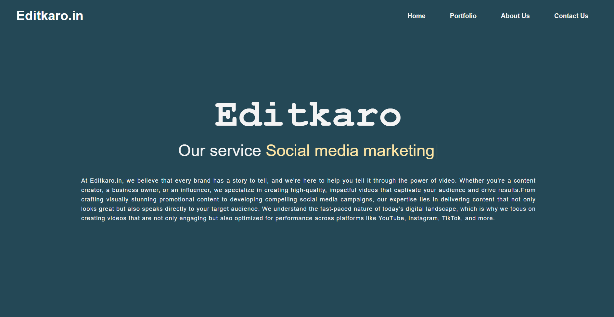

# Editkaro.in

Editkaro.in is a social media marketing and video editing agency website designed to showcase the agency's services, portfolio, and contact information. This project allows you to apply your web development skills in HTML, CSS, and JavaScript, with a focus on creating a responsive and user-friendly experience.


## Technologies Used

- HTML5
- CSS3
- JavaScript
- Google Apps Script (for form integration with Google Sheets)
- API (optional, if used for backend)

## Features

- **Home Page:** Engaging introduction and services overview with an email subscription form.
- **Portfolio Page:** Displays categorized video work including:
  - Short Form Videos
  - Long Form Videos
  - Gaming Videos
  - Football Edits
  - eCommerce Ads
  - Documentary Style
  - Color Grading
  - Anime Videos
  - Ads
- **About Us Page:** Information about the agency's mission, vision, and team.
- **Contact Us Page:** Functional form for users to submit contact information, with integration to store data in Google Sheets.

## Installation

To set up the project locally, follow these steps:

1. Clone the repository:
   ```bash
   git clone https://github.com/TenEplaysOfficial/Editkaro.in-Major-Project.git
   ```
2. Navigate to the project directory:
   ```bash
   cd Editkaro.in-Major-Project
   ```
3. Open `index.html` in your preferred web browser.

## Usage

1. Modify the HTML and CSS files as needed to customize the website.
2. Ensure the Google Apps Script is set up correctly for form submissions to Google Sheets.
3. Test the website's responsiveness on various devices.

## Deployment

Once completed, the website can be deployed using any of the following platforms:
- Netlify
- Vercel
- GitHub Pages

## Challenges Faced

During the development process, the following challenges were encountered:
- Integrating the email subscription and contact forms with Google Sheets (Not done).
- Ensuring responsiveness across multiple devices and screen sizes.
- Organizing the code structure for better maintainability.

## Contribution
Feel free to fork the repository and make improvements or suggestions. Contributions are welcome!

## Preview


## License
This project is licensed under the MIT License - see the [LICENSE](LICENSE) file for details.

*Stay connected! Follow me on [Socials](https://linktr.ee/tenegames).*
